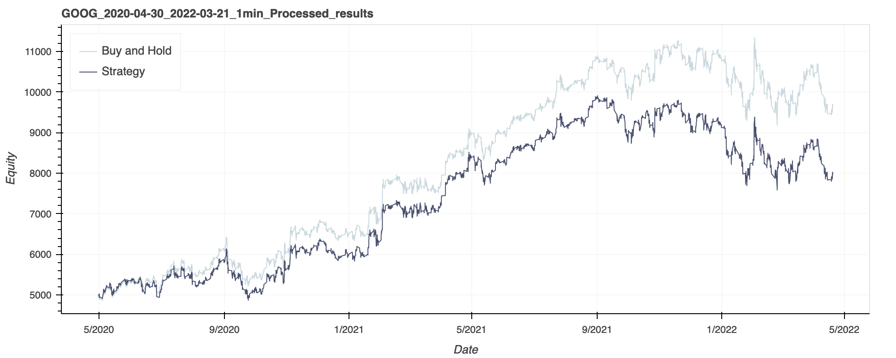
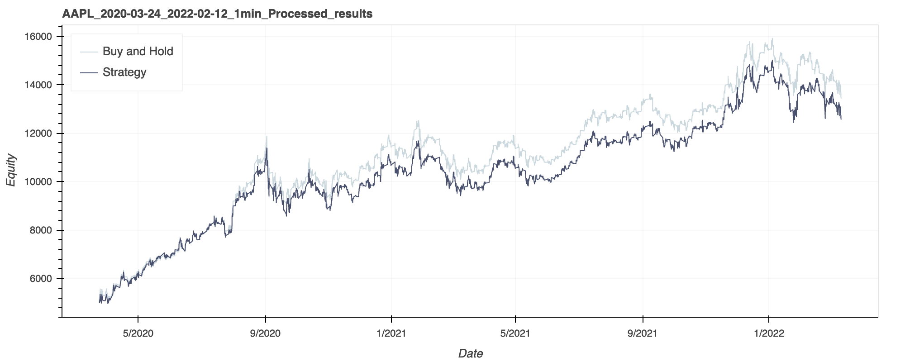
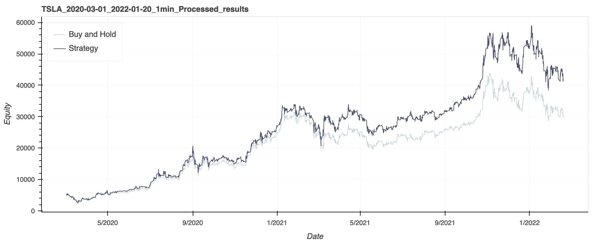

\title{Mean Reversion Trading Algorithm}
\author{Isaac Bergl, Zach Manson, Kai Marns-Morris, Talin Taparia}
\date{April 2022}
\begin{titlepage}
    \centering
    \vfill
    \maketitle
    \thispagestyle{empty}
    \vfill
    \rule{50mm}{0.5pt}
    \vfill
    \includegraphics[width=60mm]{./images/Black_Without_Patter.png}
    \vfill
    \includegraphics[width=60mm]{./images/IMC__Trading_logo_Full_color.png}
    \vfill

\textit{A project completed by the Trading Team in conjunction with}

The University of Western Australia

Quantitative Finance UWA
\end{titlepage}


\newpage

# Mean Reversion Trading Algorithm

Project completed by Team 4 (Meme Reversion) in April 2022, as part of the Semester 1 2022 Project by the QFin UWA Trading Team.

Team 4 (Meme Reversion) members: Isaac Bergl, Zach Manson, Kai Marns-Morris, Talin Taparia

## Introduction

Mean reversion is a technical trading strategy build that on the assumption that over an extended period of time all stock values will eventually return to a long-term average.  This involves determining when a stock price has significantly diverted from its mean, making entering the market accordingly, and exiting the market once the stock price has reverted to its mean.

This is determined in our strategy using multiple technical indicators, namely the Stochastic Oscillator, the Relative Strength Indicator (RSI), and the Moving Average Convergence Divergence (MACD).

### Stochastic Oscillator

The Stochastic Oscillator is a technical indicator based on the high, low and closing prices of a stock over a set lookback period.  The Oscillator produces an index between 0 and 100, which can be used as an indicator if a stock is notably oversold or overbought when compared to its price variation over the set lookback period.

The equation used to calculate the indicator is quite simple:

\begin{center}
\begin{math}
K_{fast} = \frac{close - low}{high-low}
\end{math}
\end{center}

The \begin{math}K_{fast}\end{math} value is used in conjuction with a 3 period moving average, \begin{math}D_{fast}\end{math}.  This is form is quite volatile, and in our testing was too volatile to give consistent results.  We opted for a slower variant of the the Stochastic Oscillator where \begin{math}K_{slow}\end{math} is a 3-period moving average of \begin{math}K_{fast}\end{math}, and \begin{math}D_{slow}\end{math} is a 3-period moving average of \begin{math}K_{slow}\end{math}.

In our algorithm we used a 14 day lookback period.

\newpage
### Relative Strength Index

The Relative Strength Indicator is another technical indicator used to evaluate overbought and oversold stocks.  While in this regard it is similar to the Stochastic Oscillator, in our algorithm we used it to indicate overall momentum of the stock rather than as an indicator of mean reversion.  The indicator is based on the average gain and loss of a stock over a set lookback period, resulting in an index between 0 and 100.

The equation for RSI is also quite simple:
\begin{center}
\begin{math}
RSI = 100 - (\frac{100}{1 + \frac{avg gain}{avg loss}}) 
\end{math}
\end{center}

In our algorithm, average gain and loss were exponential weighted mean calculatations, and was calculated over a 14-day lookback period.

### Moving Average Convergence Divergence (MACD)

Moving Average Convergence Divergence (MACD) is a momentum indicator based on the relationship between two exponental moving averages of different period lengths.  The subtraction of these two reveals the relative shift in the market between the two lookback periods in use.  This is used in conjunction with a third moving average of an even shorter period to represent the signal line.

In our algorithm these two moving averages converging is used as a signal to enter the market, when previous conditions have been met. We used a 26-day period and a 12-day period for fast and slow metrics, and a 9-day period for the signal line, based on best common practice.

## Mean Reverting Test

### Augmented Dickey Fuller - ADF

The ADF is a statistical and econometric formula used to check if a given time-series is stationary or not, this can also be used to test if our given stock data( which is a time series data) is stationary or mean reverting. The test algorithm checks the value in our case the 'close' price against the time index, and returns a p-value, if p-value is below 0.05( normal 5% significance number) then the time series is mean reverting.

TSLA : p-value: 0.602630490443652
AAPL : p-value: 0.26725730053984714
GOOG : p-value: 0.5653012834606965

The resultant values indicate that all 3 stocks data are mean reverting, but the degree of mean reversion of apple is less.

### Hurst Exponent 

The hurst exponent value, is another test to check if stock is mean reverting or not and also the degree of said mean reversion. The best method to check mean reversion is to get the hurst_exponent value with increasing lag times, if the value decrease as the lag increases then the stock data is mean reverting.

        1) TSLA 
Hurst exponent with 5 lags: 0.4799
Hurst exponent with 10 lags: 0.4831
Hurst exponent with 20 lags: 0.4919
Hurst exponent with 100 lags: 0.5061
Hurst exponent with 300 lags: 0.4970
Hurst exponent with 500 lags: 0.4963
Hurst exponent with 1000 lags: 0.4832
Hurst exponent with 2000 lags: 0.4608
Hurst exponent with 2700 lags: 0.4390
Hurst exponent with 3500 lags: 0.4119
Hurst exponent with 5000 lags: 0.3777

        2) AAPL
Hurst exponent with 5 lags: 0.4842
Hurst exponent with 10 lags: 0.4885
Hurst exponent with 20 lags: 0.4879
Hurst exponent with 100 lags: 0.4882
Hurst exponent with 300 lags: 0.4701
Hurst exponent with 500 lags: 0.4644
Hurst exponent with 1000 lags: 0.4567
Hurst exponent with 2000 lags: 0.4251
Hurst exponent with 2700 lags: 0.3860
Hurst exponent with 3500 lags: 0.3537
Hurst exponent with 5000 lags: 0.3153

        3) GOOG
Hurst exponent with 5 lags: 0.4961
Hurst exponent with 10 lags: 0.5032
Hurst exponent with 20 lags: 0.5073
Hurst exponent with 100 lags: 0.4891
Hurst exponent with 300 lags: 0.4405
Hurst exponent with 500 lags: 0.4073
Hurst exponent with 1000 lags: 0.3754
Hurst exponent with 2000 lags: 0.4134
Hurst exponent with 2700 lags: 0.4277
Hurst exponent with 3500 lags: 0.4277
Hurst exponent with 5000 lags: 0.3724


This test results show us that 'Google' is not that mean reverting, as the value is range bound until the last lag-time. But in the case of TSLA and AAPL, the values are only similar in the early lag-times( which are not that spread).


Hence based on the 2 tests we can observe that all 3 stocks are mean reverting, but GOOG shows less degree in the Hurst test and AAPL due to lower p-value as less degree in the ADF test. These test can also act as an indicator to the performance of any mean reversion formula/ strategy for trading.


## Algorithm

### Core Logic

Our algorithm implemented all three of these indicators to determine trading decisions, each of them used for different purposes.  The hybrid nature of this algorithm was designed with the intent to allow it to more discerning than any of the indicators used individually, and result in a higher win-rate.

The slow variant of the Stochastic Oscillator is used as a measure of mean dispersion, where particularly low and high values are indicators of oversold and overbought states of a stock, presumably set to revert to its mean.  This is the primary indicator of the algorithm.

To confirm the trend, our algorithm implements RSI as a trend confirmation indicator.  Rather than using RSI to determine overbought and oversold signals like the Stochastic Oscillator, our algorithm uses it to determine the overall direction of the stock in the form of uptrends or downtrends.  In terms of the RSI value, our algorithm treats below 50% as a downtrend and above 50% as an uptrend.

If the Stochastic Oscillator is below 20% (indicating a stock is oversold), the RSI is above 50% (indicating an uptrend), and the price is below a 100-day exponential moving average, the algorithm waits for a buy trigger.  If the RSI hits 40% or the MACD crosses the signal line before the Stochastic Oscillator shifts to indicating overbought, the algorithms enters a long position on the stock.

The inverse is true for short positions.  If the Stochastic Oscillator is above 80% (indicating a stock is overbought), the RSI is below 50% (indicating a downtrend), and the price is above at 100-day exponential moving average, the algorithm waits for a buy trigger.  If the RSI hits 60% or the MACD crosses the signal line before the Stochastic Oscillator shifts to indicating oversold, the algorithm enters a short position on the stock.

From any given position, the algorithm closes the position after the stock is determined to have reverted to the mean.  This occurs for short positions when RSI hits 60% or the MACD crosses the signal line again.  This occurs for short positions when RSI hits 40% or the MACD crosses the signal line again.  

### Stoploss

The stoploss is implemented as the price points at which we should exit our trade. The formula for the stoploss (*SL*) at \begin{math}t=0\end{math} from when the position is entered depend on the hyperparamter *STOPLOSS* (set to 0.0025 for demonstrative purposes) and is as follows for shorting:

\begin{center}
\begin{equation}
    SL_0 = PRICE_0\times(1+STOPLOSS)
\end{equation}
\end{center}

Note that for long positions the plus and minus signs would be reversed. 

As the price increases and decreases we update the stoploss for short positions - if the price decreases, update the stoploss to the current price point. This ensures we don't hold on to a position that has diverged profitably away from its buying point for too long - we sell it when it begins to fall rather then when it has fallen. 

### Combined Implementation

This core logic has a minor impact on an account when used alone as a trading algorithm.  Due to the stringent conditions required for it to enter the market, and the relatively small stoploss and profit target margin do not allow for large shifts in account value.  Due to this, in our testing, the core logic on its own results in net profits from -10% to 10% of the initial investment.

To amplify the effects of this, we suggest that this logic be combined with another trading stratey that is fallen back on when the core logic doesn't detect any signicant mean dispersion.

In our submitted implementation, we combined our core logic with a simple buy and hold strategy that was defaulted to when no mean dispersion was detected, and the core logic would otherwise be out of the market.  While rendered the long position entry logic indistinguishable from default behaviour, we have included it in our source code to show how it may be used if the fallback strategy were different.  This implementation in effect holds a long position until it detects a mean dispersion, enters a short position accordingly, and returns to a long position once the mean reversion has occured or stoploss triggered.

This combined implementation resulted in consistent profitability with the core mean reversion logic providing a wider ranger of results, sometimes falling short of simple buy and hold and other times pushing beyond it.

### Potential Improvements

Firstly, we could make major improvements to the stoploss. As implemented the stoploss is calulated as a constant percentage of the price at purchase. This flat rate could be optimised to a specific stock in practice, and from testing certain values worked better for some stocks and worse for others. Furthermore the stoploss could implement a wide array of market measures to dynamically fit the market conditions, which could limit losses further and result in higher resturns.

The update rule for the stoploss could be implemented in a similar way to the takeprofit - however in our testing it gave negative improvements. Currently the only way the short position exits is if it hits the takeprofit or the stoploss - however the need for a takeprofit is debatable - as long as the stoploss is non-decreasing we can always realise our profits.  

Secondly, the logic we chose to investigate used three different tried and tested market indicators, however the rules for when to enter or exit a position was arbitary. A future improvement could be to use each market measure and combine them into a single value between -1 and 1 that incidicates when to buy and sell based on mean reversion. Each indicator would be weighted by a machine learning model that optimises the weights for a specific stock. 

Moreover, in our startegy we relied on technichal indicators as the fundamentals cannot indicate about oversold or overbought market sentiment. But, this causes limitations as without fundamentals we cannot predict the direction of the trendline. In mean reversion especially in automated strategy with strict stoploss, one needs a way to check the direction of tha base trendline( upwards, flat, downwards) because otherwise the win rate reduces even if the underlying strategy was accurate. 

Lastly, there are multiple hyperparamters to our algorithm. For example, the MACD moving average window sizes, thresholds for RSI, STOPLOSS percentage, stochastic threshold, etc. The values presented in our algorithm were picked based on common best practice - however these parameters should be optimsed for a specific asset. This can be done through manual testing, further financial analysis or as an optimisation task for machine learning. 


\pagebreak
## Testing

Our algorithm preprocessing flattens all data to 30 minute periods which we found to be optimal in our testing.  Our default parameters used a 14-period lookback window for the Stochastic Oscillator and RSI, and a 26-12-9 setting for MACD.  The long-term EMA used used a 100-period lookback.

### GOOG 2020-04-30 to 2022-03-21 1 Minute Intervals

 \

```
Buy and Hold : 92.95%
Net Profit   : 4647.56
Strategy     : 59.58%
Net Profit   : 2978.85
Longs        : 19
Sells        : 18
Shorts       : 18
Covers       : 18
--------------------
Total Trades : 73
```

\newpage
### AAPL 2020-03-24 to 2022-02-12 1 Minute Intervals

 \

```
Buy and Hold : 168.75%
Net Profit   : 8437.4
Strategy     : 151.4%
Net Profit   : 7570.11
Longs        : 28
Sells        : 27
Shorts       : 26
Covers       : 26
--------------------
Total Trades : 107
```

\newpage
### TSLA 2020-03-01 to 2022-01-20 1 Minute Intervals

 \

```
Buy and Hold : 502.32%
Net Profit   : 25116.22
Strategy     : 734.82%
Net Profit   : 36740.77
Longs        : 23
Sells        : 22
Shorts       : 22
Covers       : 22
--------------------
Total Trades : 89
```

\newpage
